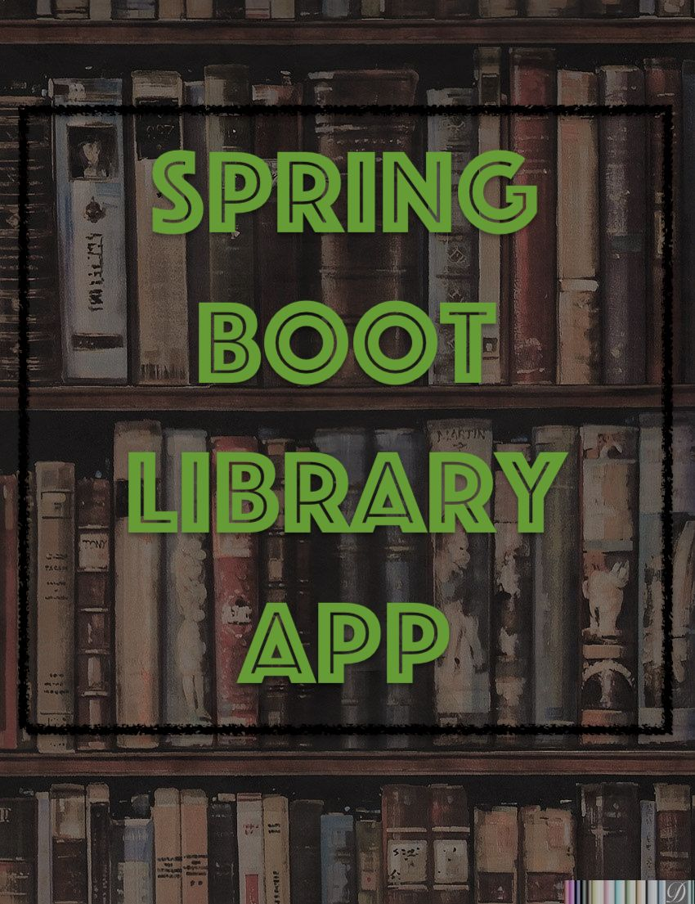

##  Description
A **REST API** that demonstrates library functionality, running in a virtual environment. Developed using **Spring Boot** and **Spring Data JPA**. 
**Docker Compose** is used to orchestrate the various containers required for the application. The API is fully documented and has a detailed description of all endpoints using **Swagger**.
Rigorous testing using **JUnit 5** and **Mockito** guarantees the reliability of the code.

---

##  Project structure
Project based on Three-Tier architecture:
- **Presentation tier** (controllers) - provides user interaction with the application
- **Logic tier** (services) - establishes the set of available operations and coordinates the program's response to each operation.
- **Data tier** (repository) - represents interaction with the database

---

## Technologies
- Java 11
- Maven 4
- Spring Boot 2.7
- MySQL 5
- JUnit 5
- Mockito
- Swagger 
- Docker Compose

---
## Implemenation details
- **Entities** represent a set of columns in the database
- **DTOs** represent communication with the user
- **DTO mappers** for converting DTOs to entities and vice versa
- All interaction with the database occurs at the **repository** level
- **SpringFoxConfig class** is responsible for Swagger configuration
- All operations are available at the **Service**
- All interaction client-server occurs through **Controllers**
- **Spring Boot validation annotations** are used for field validation
- **Custom ValidPhoneNumber annotation** is used for phone number validation
- **CustomGlobalExceptionHandler** handles validation errors and returns objects
- **SortingService** makes it possible to set any parameters for sorting the output data
- All custom code logic is covered by tests using **JUnit 5**. **RestAssuredMockMvc** is used for sending mocked requests to controllers.
- All endpoints are documented and can be tested using **Swagger**.
- **Checkstyle plugin** helps enforce coding standards and best practices.

---

## Quickstart
### You can run the application in two ways: in a virtual machine or locally on your system
**For the first option, perform the following actions:**
1. Fork this repository
2. Clone the project to your computer
3. Install [Docker](https://www.docker.com/products/docker-desktop/)
4. Open the project and run **mvn clean package** in terminal to build the project and then run **docker compose up**
5. The application and database with necessary configurations will run as separate services that can already interact with each other. The interaction description is located in the **docker-compose.yml** file.
6. To send a request to the application, use the access port to the virtual machine: **http://localhost:6868**
7. For testing endpoints, you can use Swagger UI: **http://localhost:6868/swagger-ui/#/**
8. You can also use InjectorController to inject some test data directly to the DB: **http://localhost:6868/inject**
9. To connect to the local database, which is raised as a separate service, access port to the virtual machine is also used (it is already configured using parameters from .env):
Host: **localhost**; Port: **3307**; User: **root**; Password: **826220228**; Database: **library**

**To run application locally, perform the following actions:**
1. Fork this repository
2. Clone the project to your computer
3. Install MySQL and configure the database connection.
4. Add **DB_USERNAME** and **DB_PASSWORD** **application.properties** file
5. Run **LibraryApiApplication**
6. To send a request to the application, use the local port: **http://localhost:8080**
7. For testing endpoints, you can use Swagger UI: **http://localhost:8080/swagger-ui/#/**
8. You can also use InjectorController to inject some test data directly to the DB: **http://localhost:8080/inject**

---

## Author

[Vitalii Shkliarskyi](https://github.com/VitaliiShkliarskyi)